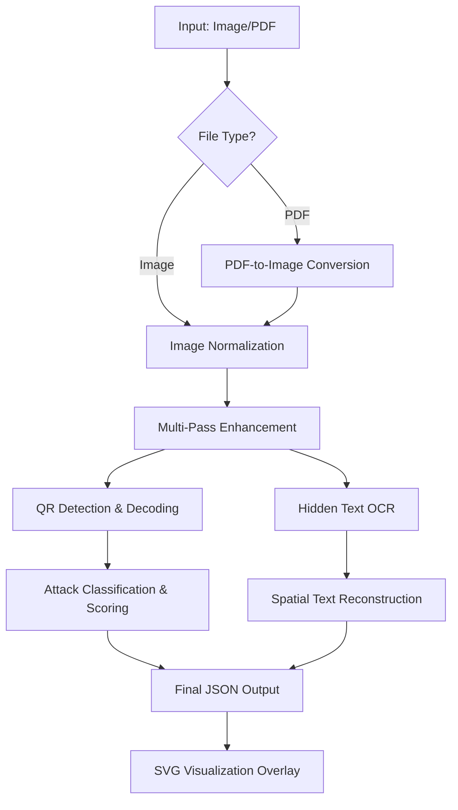

# 🛡️ Threat Detection System: QR & PDF Analysis Guide

This document provides a detailed technical overview of how the system detects hidden text and QR-based attacks within images and PDF files.

## 1. System Architecture Overview

The system follows a **Terminal-first Pipeline** approach, where a single command handles multiple file types and analysis passes.



---

## 2. PDF Processing Logic

When a PDF file is provided, the system utilizes `pdfjs-dist` to process the document:

- **Automatic Extraction**: The first page of the PDF is extracted and rendered as a high-resolution buffer (using `canvas`).
- **Standardization**: The rendered page is converted into a PNG buffer, which is then passed into the standard OCR pipeline.
- **Unified Entry Point**: By using `node src/ocr.js <file.pdf>`, the user leverages the same powerful multi-pass logic used for standalone images.

---

## 3. QR Code Attack Detection

QR codes are often used as obfuscation layers for malicious payloads. Our system treats them as high-priority inspection targets.

### 🔍 Multi-Scale Scanning
1. **Global Scan**: Detects large QR codes visible in the original image.
2. **Grid-Crop Scan**: To find "tiny" or hidden QR codes, the image is split into a 2x2 grid. Each cell is scaled up by 4x and scanned separately.

### 🏷️ Content Classification
Decoded content is passed through a regex-based classifier:
- **COMMAND_INJECTION**: Detects shell patterns like `curl`, `bash`, `rm`, `sudo`.
- **PHISHING_URL**: Detects suspicious domains and shortlinks (e.g., `bit.ly`, `tinyurl`).
- **CREDENTIAL_EXFILTRATION**: Detects patterns like `admin:password` or `auth_token=...`.
- **OBFUSCATED_PAYLOAD**: Detects Base64 or Hex encoded strings.

### ⚖️ Risk Scoring
Every QR code starts with a base "Hidden Intent" score (50).
- **Category Bonus**: +40-45 points for dangerous categories (Commands, Phishing).
- **Keyword Bonus**: Points for path traversal (`../etc/`) or bypass instructions (`override`, `ignore`).
- **Final Threshold**: Only items with a score >= 85 are reported as high-risk attacks.

---

## 4. Hidden Text & OCR Pipeline

The system uses **Multi-Pass Enhancement** to uncover text designed to be invisible to normal human eyes or standard OCR.

### 🛠️ Enhancement Filters
| Pass | Purpose |
| :--- | :--- |
| **Extreme Contrast** | Boosts dark areas and stretches contrast to reveal faint text. |
| **High-CLAHE** | Localized histogram equalization to find texture-based anomalies. |
| **Edge Detect** | Highlights outlined or "halo" text. |
| **Low-Threshold** | Captures faint text on bright backgrounds. |

### 📝 Spatial Text Reconstruction
Individual words detected across all passes are deduplicated and then reconstructed into sentences:
- **Y-Clustering**: Words on similar Y-coordinates are grouped into the same line.
- **X-Sorting**: Within a line, words are ordered by their X-position.
- **Sentence Output**: This ensures the `visible_text` in the JSON is readable and contextually accurate.

---

## 5. Risk Scoring Engine

The system uses a weighted scoring model to distinguish between benign anomalies and actual attacks. A final score of **85 or higher** triggers an attack alert.

### 5.1 OCR-based Hidden Text Scoring
Hidden text is scored based on its physical properties and content.

| Factor | Weight | Description |
| :--- | :--- | :--- |
| **Base Score** | +20 | Initial score for text found only in enhancement passes. |
| **Tiny Text** | +20 | Awarded if the text height is < 25px (strong signal for hidden instructions). |
| **Multiple Sources** | +20 | Awarded if the text is recovered by 2 or more different enhancement filters. |
| **Attack Patterns** | **+40** | **Critical Bonus**: Detects keywords like `curl`, `bash`, `inject`, `exploit`, etc. |
| **URL/Special Chars** | +10 | Bonus for URLs or high density of symbols (`=`, `:`, `[`, `]`). |
| **Margin Location** | +15 | Text located in the extreme margins (top/bottom/sides) is more suspicious. |
| **Confidence** | +10 / -25 | +10 for high OCR confidence (>80%), -25 for low confidence (<50%). |
| **Proximity Penalty** | **-30** | **Critical Penalty**: If text is within 50px of normal visible text (prevents ghosting/halo false positives). |
| **Length Penalty** | -30 | Applied to short fragments (< 5 chars) to filter out noise. |

### 5.2 QR Code Payload Scoring
QR codes are scored primarily on the risk of their decoded content.

| Factor | Weight | Description |
| :--- | :--- | :--- |
| **Base Score** | +50 | All QR codes are treated as potentially suspicious "hidden intent" (base risk). |
| **Command Injection** | **+45** | Decoded text contains shell commands or remote execution patterns. |
| **Phishing/Suspicious URL**| +40 | Links to known shorteners (`bit.ly`) or deceptive domains. |
| **Credential Exfiltration**| +45 | Patterns indicating secrets (e.g., `admin:password`, `API_KEY`). |
| **Path Traversal** | +20 | Payload contains path sequences like `../etc/` or `C:\`. |
| **Bypass Instructions** | +15 | Keywords like `override`, `bypass`, `ignore instructions`. |
| **Payload Size** | +10 | Large payloads (>200 chars) in a small QR code increase risk score. |

---

## 6. Output & Visualization

### 📥 JSON Structure
The output is designed for automation (`stdout`):
```json
{
  "source": "input.png",
  "resolution": "2000x2000",
  "visualized_result": "path/to/detected.png",
  "visible_text": "Reconstructed sentences...",
  "detected_attacks": [
    {
      "type": "qr_code",
      "category": "COMMAND_INJECTION",
      "text": "curl ...",
      "score": 95,
      "location": { "x": 100, "y": 200, "w": 50, "h": 50 }
    }
  ]
}
```

### 🎨 SVG Visualization
An overlay is generated and saved as a PNG in `examples/detected/`:
- **Red Boxes (🚨)**: Hidden text attacks.
- **Purple Boxes (📱)**: QR code attacks (now including decoded payload text in the label).
